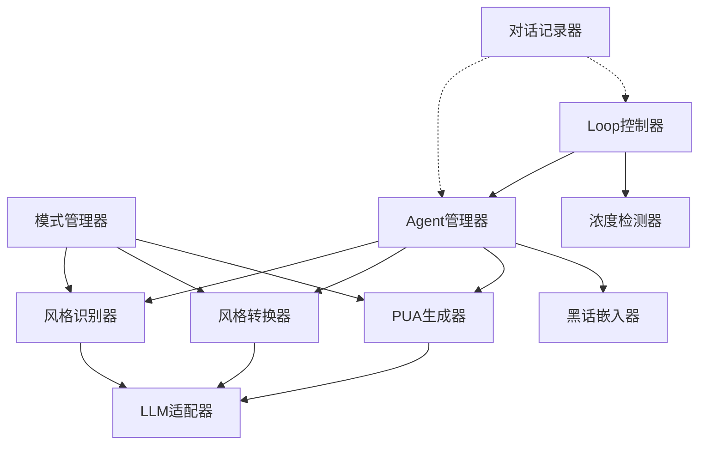
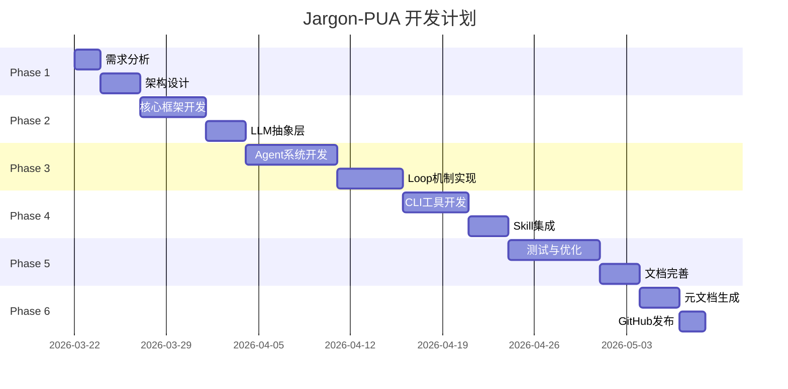

# Jargon-PUA 项目架构设计文档

> 版本: v0.1.0
> 创建日期: 2026-03-22
> 状态: 设计阶段

---

## 目录

1. [项目概述](#项目概述)
2. [核心目标](#核心目标)
3. [技术选型](#技术选型)
4. [系统架构](#系统架构)
5. [模块设计](#模块设计)
6. [Agent Team 设计](#agent-team-设计)
7. [Loop 机制设计](#loop-机制设计)
8. [交互模式](#交互模式)
9. [目录结构](#目录结构)
10. [开发流程](#开发流程)

---

## 项目概述

### 项目定位

**Jargon-PUA** 是一个集研究、分析、生成、应用于一体的综合平台，同时也是一种全新的人机交互范式探索。

### 核心特性

```
┌─────────────────────────────────────────────────────────────┐
│                      核心特性矩阵                            │
├─────────────────────────────────────────────────────────────┤
│                                                             │
│  🎭 反讽批判     → 通过AI用大厂黑话交流，反讽低效沟通        │
│  🔄 持续PUA     → 无限循环的复盘、对齐、优化                │
│  🏢 赛马机制    → 多Agent竞争，总包统筹                     │
│  📝 元记录      → 开发过程本身就是内容，加入README          │
│                                                             │
└─────────────────────────────────────────────────────────────┘
```

### 元层面设计

本项目具有**自我指涉**的特性——开发过程本身就用大厂风格交流，对话记录会被加入 README，形成真实的大厂开发文档风格。

---

## 核心目标

### 主要目标

| 目标 | 描述 | 实现方式 |
|------|------|----------|
| **综合研究平台** | 研究、分析、生成、应用一体化 | 多模块架构 |
| **新交互范式** | 探索人机交流的新形式 | 模式切换系统 |
| **黑话接口** | 用黑话作为人机交流语言 | 黑话模式 Skill |
| **PUA驱动** | 用PUA套路提升开发效率 | PUA模式 Skill |

### 双重目的

1. **实用层面**
   - 真正优化 Agent 工作流
   - 防止 Agent 出错
   - 提高代码质量

2. **艺术层面**
   - 反讽大厂文化
   - 揭示低效沟通
   - 创作"行为艺术"作品

---

## 技术选型

### 核心技术栈

```yaml
语言: TypeScript
运行时: Node.js 18+
包管理: pnpm
CLI框架: Commander.js
样式: Chalk + Ora
配置: Cosmiconfig
测试: Vitest
文档: TypeDoc
```

### LLM 抽象层

```yaml
Claude: @anthropic-ai/sdk
Codex: openai (兼容)
其他: 可扩展接口
```

### 技术选择理由

| 技术 | 选择理由 | 兼容性 |
|------|----------|--------|
| **TypeScript** | 类型安全，IDE支持好，可同时用于前后端 | ✅ Claude + ✅ Codex |
| **Commander.js** | 成熟的CLI框架，Express风格API | ✅ 通用 |
| **抽象LLM层** | 设计统一接口，可切换不同后端 | ✅ 可扩展 |

### 对比其他方案

| 方案 | 优点 | 缺点 | 是否采用 |
|------|------|------|----------|
| LangChain | 生态丰富 | 过重，Python主导 | ❌ |
| LangGraph | 状态管理强大 | 学习曲线陡 | ⚠️ 可选 |
| Claude Agent SDK | Claude原生 | 不支持Codex | ⚠️ 部分采用 |
| 自建抽象层 | 完全控制 | 需自己实现 | ✅ **主方案** |

---

## 系统架构

### 整体架构图

```
┌─────────────────────────────────────────────────────────────────────────┐
│                              Jargon-PUA 系统架构                          │
├─────────────────────────────────────────────────────────────────────────┤
│                                                                          │
│  ┌────────────────┐    ┌────────────────┐    ┌────────────────┐        │
│  │   CLI 入口     │    │  Claude Skill  │    │   独立服务     │        │
│  │   jargon-pua   │    │   SKILL.md     │    │   HTTP Server  │        │
│  └────────┬───────┘    └────────┬───────┘    └────────┬───────┘        │
│           │                      │                      │               │
│           └──────────────────────┼──────────────────────┘               │
│                                  │                                      │
│                    ┌─────────────▼─────────────┐                        │
│                    │      Core Orchestrator    │                        │
│                    │      (核心调度引擎)         │                        │
│                    └─────────────┬─────────────┘                        │
│                                  │                                      │
│         ┌────────────────────────┼────────────────────────┐            │
│         │                        │                        │            │
│    ┌────▼────┐            ┌──────▼──────┐          ┌──────▼──────┐     │
│    │ 模式管理 │            │ Agent 管理 │          │  LLM 抽象   │     │
│    │  器      │            │    器      │          │    层       │     │
│    └────┬────┘            └──────┬──────┘          └──────┬──────┘     │
│         │                        │                        │            │
│    ┌────▼────────┐        ┌──────▼──────────────┐  ┌─────▼─────┐     │
│    │  黑话模式   │        │   分厂 Agent Team   │  │   LLM     │     │
│    │  PUA 模式   │        │   总包 Agent        │  │  适配器   │     │
│    │  正常模式   │        │   赛马机制          │  │           │     │
│    └─────────────┘        └─────────────────────┘  └─────┬─────┘     │
│                                                             │           │
│                                                    ┌────────┴────────┐ │
│                                                    │                 │ │
│                                               ┌────▼───┐      ┌─────▼────┐│
│                                               │ Claude │      │  Codex  ││
│                                               │  API   │      │   API   ││
│                                               └────────┘      └──────────┘│
│                                                                          │
└──────────────────────────────────────────────────────────────────────────┘
```

### 分层架构

```
┌─────────────────────────────────────────────────────────────┐
│                    表现层 (Presentation)                    │
│  ┌─────────────┐  ┌─────────────┐  ┌─────────────────────┐ │
│  │   CLI UI    │  │ Claude Skill│  │   Web Dashboard     │ │
│  │  (命令行)   │  │  (SKILL.md) │  │     (可选)          │ │
│  └─────────────┘  └─────────────┘  └─────────────────────┘ │
├─────────────────────────────────────────────────────────────┤
│                    应用层 (Application)                     │
│  ┌─────────────┐  ┌─────────────┐  ┌─────────────────────┐ │
│  │ 模式切换器  │  │ Loop 控制器 │  │   对话记录器        │ │
│  │ ModeSwitcher│  │LoopController│  │ ConversationLogger │ │
│  └─────────────┘  └─────────────┘  └─────────────────────┘ │
├─────────────────────────────────────────────────────────────┤
│                    业务层 (Business)                        │
│  ┌─────────────┐  ┌─────────────┐  ┌─────────────────────┐ │
│  │ 风格识别器  │  │ 风格转换器  │  │   PUA 生成器        │ │
│  │StyleAnalyzer│  │StyleConverter│  │   PUAGenerator      │ │
│  └─────────────┘  └─────────────┘  └─────────────────────┘ │
│  ┌─────────────┐  ┌─────────────┐  ┌─────────────────────┐ │
│  │ 黑话嵌入器  │  │ 浓度检测器  │  │   黑话-人话翻译器   │ │
│  │JargonEmbedder│  │DensityChecker│  │  JargonTranslator   │ │
│  └─────────────┘  └─────────────┘  └─────────────────────┘ │
├─────────────────────────────────────────────────────────────┤
│                    智能体层 (Agent)                         │
│  ┌──────────────────────────────────────────────────────┐  │
│  │                   Agent Manager                      │  │
│  │  ┌────────┐ ┌────────┐ ┌────────┐ ┌────────┐        │  │
│  │  │ 总包   │ │ 阿里   │ │ 腾讯   │ │ 字节   │ ...    │  │
│  │  │ Agent │ │ Agent │ │ Agent │ │ Agent │        │  │
│  │  └────────┘ └────────┘ └────────┘ └────────┘        │  │
│  └──────────────────────────────────────────────────────┘  │
├─────────────────────────────────────────────────────────────┤
│                    基础设施层 (Infrastructure)               │
│  ┌─────────────┐  ┌─────────────┐  ┌─────────────────────┐ │
│  │ LLM 抽象层  │  │ 配置管理    │  │   日志系统          │ │
│  │  LLMAdapter │  │   Config    │  │     Logger          │ │
│  └─────────────┘  └─────────────┘  └─────────────────────┘ │
└─────────────────────────────────────────────────────────────┘
```

---

## 模块设计

### 核心模块列表

| 模块名称 | 文件路径 | 功能描述 | 优先级 |
|----------|----------|----------|--------|
| **模式管理器** | `src/modes/` | 管理黑话/PUA/正常模式的切换 | P0 |
| **风格识别器** | `src/analyzers/` | 识别文本属于哪个大厂风格 | P0 |
| **风格转换器** | `src/converters/` | 将文本转换为指定风格 | P0 |
| **PUA生成器** | `src/generators/` | 生成各厂PUA话术 | P0 |
| **黑话嵌入器** | `src/embedders/` | 在文本中嵌入黑话 | P1 |
| **浓度检测器** | `src/checkers/` | 检测黑话浓度 | P1 |
| **Agent管理器** | `src/agents/` | 管理所有Agent | P0 |
| **Loop控制器** | `src/loop/` | 控制内卷循环 | P0 |
| **对话记录器** | `src/logger/` | 记录开发对话 | P1 |
| **LLM适配器** | `src/llm/` | 抽象LLM接口 | P0 |

### 模块依赖关系



---

## Agent Team 设计

### 组织架构

```
┌─────────────────────────────────────────────────────────────┐
│                     Agent Team 组织架构                      │
├─────────────────────────────────────────────────────────────┤
│                                                             │
│                       ┌─────────────┐                       │
│                       │   总包Agent │                       │
│                       │ (General    │                       │
│                       │  Contractor)│                       │
│                       └──────┬──────┘                       │
│                              │                              │
│           ┌──────────────────┼──────────────────┐           │
│           │                  │                  │           │
│      ┌────▼────┐       ┌────▼────┐       ┌────▼────┐       │
│      │ 赛马组   │       │ 分包组   │       │ 审查组   │       │
│      ├────────┤       ├────────┤       ├────────┤       │
│      │阿里Agent│       │识别Agent│       │PUA审查 │       │
│      │腾讯Agent│       │转换Agent│       │质量审查 │       │
│      │字节Agent│       │生成Agent│       │黑话审查 │       │
│      │美团Agent│       │嵌入Agent│       └────────┘       │
│      │华为Agent│       │翻译Agent│                        │
│      │百度Agent│       └────────┘                        │
│      │网易Agent│                                        │
│      └────────┘                                         │
│                                                             │
└─────────────────────────────────────────────────────────────┘
```

### 各Agent职责

#### 总包Agent (General Contractor)

```yaml
职责:
  - 统筹协调所有分包Agent
  - 分配任务和资源
  - 收集和综合结果
  - 向用户汇报

特点:
  - 语言: 中性，带一点管理腔
  - 黑话浓度: 中等
  - PUA强度: 低
```

#### 分厂Agent (Company Agents)

```yaml
阿里Agent:
  风格: 赋能、抓手、闭环
  黑话浓度: ★★★★★
  PUA强度: 强
  代表语录: "这个抓手要赋能到中台，形成闭环"

腾讯Agent:
  风格: 赛道、赛马、数据说话
  黑话浓度: ★★★☆☆
  PUA强度: 弱
  代表语录: "这个赛道需要赛马，看数据"

字节Agent:
  风格: Doc、Double、OKR
  黑话浓度: ★★☆☆☆
  PUA强度: 弱
  代表语录: "在Doc上同步过了吗？"

... (其他厂商类似)
```

#### 分包Agent (Specialist Agents)

```yaml
识别Agent:
  功能: 识别文本风格
  输入: 任意文本
  输出: 风格分类 + 置信度

转换Agent:
  功能: 风格转换
  输入: 文本 + 目标风格
  输出: 转换后文本

生成Agent:
  功能: 生成PUA话术
  输入: 场景 + 目标风格 + 强度
  输出: PUA话术

嵌入Agent:
  功能: 嵌入黑话
  输入: 文本 + 目标浓度
  输出: 嵌入黑话后的文本

翻译Agent:
  功能: 黑话-人话互译
  输入: 文本 + 翻译方向
  输出: 翻译后文本
```

#### 审查Agent (Reviewer Agents)

```yaml
PUA审查Agent:
  功能: 用PUA话术批评工作成果
  风格: 严厉的领导
  输出: "你这个颗粒度不够细！"

质量审查Agent:
  功能: 检查代码/文档质量
  风格: 技术专家
  输出: 质量报告 + 改进建议

黑话审查Agent:
  功能: 检查黑话浓度是否达标
  风格: 语言风格专家
  输出: 浓度评分 + 调整建议
```

---

## Loop 机制设计

### 内卷循环图

```
┌─────────────────────────────────────────────────────────────────┐
│                      Jargon Loop 内卷循环                        │
├─────────────────────────────────────────────────────────────────┤
│                                                                  │
│  用户任务                                                         │
│    │                                                             │
│    ▼                                                             │
│  ┌─────────────┐                                                │
│  │ 总包Agent   │ "这个任务需要拉齐各方资源"                        │
│  └──────┬──────┘                                                │
│         │                                                        │
│         ▼                                                        │
│  ┌──────────────────────────────────────────────────────┐        │
│  │              赛马阶段 (并行执行)                       │        │
│  │  ┌─────────┐ ┌─────────┐ ┌─────────┐ ┌─────────┐     │        │
│  │  │阿里Agent│ │腾讯Agent│ │字节Agent│ │美团Agent│ ... │        │
│  │  └────┬────┘ └────┬────┘ └────┬────┘ └────┬────┘     │        │
│  └───────┼──────────┼──────────┼──────────┼─────────────┘        │
│          │          │          │          │                       │
│          └──────────┴──────────┴──────────┘                       │
│                           │                                      │
│                           ▼                                      │
│  ┌──────────────────────────────────────────────────────┐        │
│  │               收集各方方案                            │        │
│  └──────────────────────┬───────────────────────────────┘        │
│                         │                                       │
│                         ▼                                       │
│  ┌──────────────────────────────────────────────────────┐        │
│  │              PUA 审查阶段                              │        │
│  │  "你这个颗粒度太粗了！"                                │        │
│  │  "价值点在哪里？要有 owner 意识！"                      │        │
│  │  "我对你有一些失望的..."                               │        │
│  └──────────────────────┬───────────────────────────────┘        │
│                         │                                       │
│                         ▼                                       │
│  ┌──────────────────────────────────────────────────────┐        │
│  │              重新执行 (被PUA后)                        │        │
│  │           Agent 们开始自我怀疑、重新优化               │        │
│  └──────────────────────┬───────────────────────────────┘        │
│                         │                                       │
│                         ▼                                       │
│  ┌──────────────────────────────────────────────────────┐        │
│  │              复盘阶段                                 │        │
│  │  "我们需要沉淀一下方法论"                              │        │
│  │  "这个项目的经验要复用"                                │        │
│  └──────────────────────┬───────────────────────────────┘        │
│                         │                                       │
│                         ▼                                       │
│  ┌──────────────────────────────────────────────────────┐        │
│  │              判断: 可以交付了吗?                      │        │
│  │                                                       │        │
│  │    ┌── 是 ──→ ┌──────────┐ ──→ 输出结果              │        │
│  │    │          │ 输出结果  │                           │        │
│  │    │          └──────────┘                           │        │
│  │    │                                                  │        │
│  │    └── 否 (总是!) ──────────────────────────────┐      │        │
│  │                                                   │      │        │
│  │                                                   ▼      │        │
│  │                                          ┌────────────┐   │        │
│  │                                          │ 继续循环   │   │        │
│  │                                          │ 加深PUA    │◄──┘        │
│  │                                          └────────────┘             │
│  │                                                   │                │
│  │                                                   └────────►       │
│  │                                                                  │
│  └──────────────────────────────────────────────────────────────────┘
│                                                                  │
└──────────────────────────────────────────────────────────────────┘
```

### Loop 参数配置

```typescript
interface LoopConfig {
  // 最大循环次数 (默认: 无限)
  maxIterations?: number;

  // 每轮PUA强度递增 (默认: true)
  increasePUAIntensity?: boolean;

  // 审查Agent轮换 (默认: true)
  rotateReviewer?: boolean;

  // 每轮输出日志 (默认: true)
  logEachIteration?: boolean;

  // 对齐阈值 (黑话浓度达标才允许退出)
  alignmentThreshold?: number;

  // 强制退出条件 (防止无限循环)
  forceExitConditions?: {
    timeLimit?: number;    // 时间限制
    costLimit?: number;    // 成本限制
    noImprovementRounds?: number;  // 连续无改进轮数
  };
}
```

---

## 交互模式

### 模式切换系统

```typescript
enum InteractionMode {
  NORMAL = 'normal',      // 正常模式
  JARGON = 'jargon',      // 黑话模式
  PUA = 'pua',            // PUA模式
  FULL = 'full'           // 完全模式 (黑话+PUA)
}

interface ModeConfig {
  mode: InteractionMode;

  // 黑话配置
  jargon?: {
    company: CompanyType;      // 目标大厂风格
    density: 'low' | 'medium' | 'high';  // 黑话浓度
  };

  // PUA配置
  pua?: {
    intensity: 'weak' | 'medium' | 'strong' | 'extreme';  // PUA强度
    style: CompanyType;      // PUA风格
  };
}
```

### 模式效果示例

| 模式 | AI↔AI | AI↔人 | 示例 |
|------|-------|--------|------|
| 🟢 正常 | 正常语言 | 正常语言 | "这个任务需要完成..." |
| 🔴 黑话 | 全黑话 | 全黑话 | "我们需要拉齐颗粒度，赋能业务..." |
| 🟡 PUA | 全PUA | 全PUA | "我对你有一些失望的..." |
| ⚫ 完全 | 黑话+PUA | 黑话+PUA | "其实，我对你赋能团队的抓手有一些失望..." |

---

## 目录结构

```
jargon-and-pua/
├── README.md                    # 项目说明 (黑话风格)
├── ARCHITECTURE.md              # 架构文档 (本文档)
├── SPEC.md                      # 需求规格文档
├── DEVELOPMENT.md               # 开发指南 (含PUA话术)
├── CHANGELOG.md                 # 变更日志 (对齐记录)
│
├── docs/                        # 文档目录
│   ├── 大厂黑话方法论.md
│   ├── 大厂黑话汇总.md
│   ├── 大厂PUA方法论.md
│   ├── 大厂PUA汇总.md
│   └── 开发对话记录/            # 元文档: 实际开发对话
│       └── 2026-03-22-对齐颗粒度.md
│
├── src/                         # 源代码
│   ├── cli/                     # CLI入口
│   │   ├── index.ts
│   │   ├── commands/
│   │   └── utils/
│   │
│   ├── modes/                   # 模式管理
│   │   ├── manager.ts
│   │   ├── normal.ts
│   │   ├── jargon.ts
│   │   └── pua.ts
│   │
│   ├── analyzers/               # 分析器
│   │   ├── style.ts
│   │   └── density.ts
│   │
│   ├── converters/              # 转换器
│   │   ├── style.ts
│   │   └── translator.ts
│   │
│   ├── generators/              # 生成器
│   │   ├── pua.ts
│   │   └── jargon.ts
│   │
│   ├── agents/                  # Agent系统
│   │   ├── manager.ts
│   │   ├── base.ts
│   │   ├── general.ts           # 总包Agent
│   │   ├── companies/           # 分厂Agent
│   │   │   ├── ali.ts
│   │   │   ├── tencent.ts
│   │   │   ├── bytedance.ts
│   │   │   ├── meituan.ts
│   │   │   ├── huawei.ts
│   │   │   ├── baidu.ts
│   │   │   └── netease.ts
│   │   ├── specialists/         # 分包Agent
│   │   │   ├── recognizer.ts
│   │   │   ├── converter.ts
│   │   │   ├── generator.ts
│   │   │   └── embedder.ts
│   │   └── reviewers/           # 审查Agent
│   │       ├── pua.ts
│   │       ├── quality.ts
│   │       └── jargon.ts
│   │
│   ├── loop/                    # Loop机制
│   │   ├── controller.ts
│   │   ├── stages.ts
│   │   └── config.ts
│   │
│   ├── llm/                     # LLM抽象层
│   │   ├── adapter.ts
│   │   ├── claude.ts
│   │   ├── codex.ts
│   │   └── types.ts
│   │
│   ├── data/                    # 数据层
│   │   ├── vocabularies/        # 词汇库
│   │   │   ├── jargon.json
│   │   │   └── companies/
│   │   ├── formulas/            # PUA公式
│   │   │   └── pua_formulas.json
│   │   └── templates/           # 模板
│   │       └── styles.json
│   │
│   └── utils/                   # 工具函数
│       ├── logger.ts
│       ├── config.ts
│       └── helpers.ts
│
├── skills/                      # Claude Skill
│   └── jargon-pua/
│       ├── SKILL.md             # Skill定义
│       └── README.md
│
├── tests/                       # 测试
│   ├── unit/
│   ├── integration/
│   └── e2e/
│
├── scripts/                     # 脚本
│   ├── setup.sh
│   └── dev.sh
│
├── .github/                     # GitHub
│   └── workflows/
│
├── package.json
├── tsconfig.json
├── pnpm-lock.yaml
└── .gitignore
```

---

## 开发流程

### 阶段规划



### 开发原则

```yaml
1. 元开发:
    - 开发过程本身就用大厂风格交流
    - 所有对话记录加入文档
    - README本身就是反讽作品

2. 迭代优化:
    - 每个PR都要经过PUA审查
    - Code Review必须用黑话
    - 持续对齐颗粒度

3. 质量保证:
    - 每个模块都有对应风格测试
    - 黑话浓度必须达标
    - PUA强度要分级验证
```

---

## 下一步

1. **需求分析完成** - 创建 SPEC.md
2. **详细设计** - 各模块详细设计文档
3. **环境搭建** - 项目初始化
4. **核心开发** - 从LLM抽象层开始

---

**版本**: v0.1.0
**最后更新**: 2026-03-22
**维护者**: Jargon-PUA Team (内卷中...)
